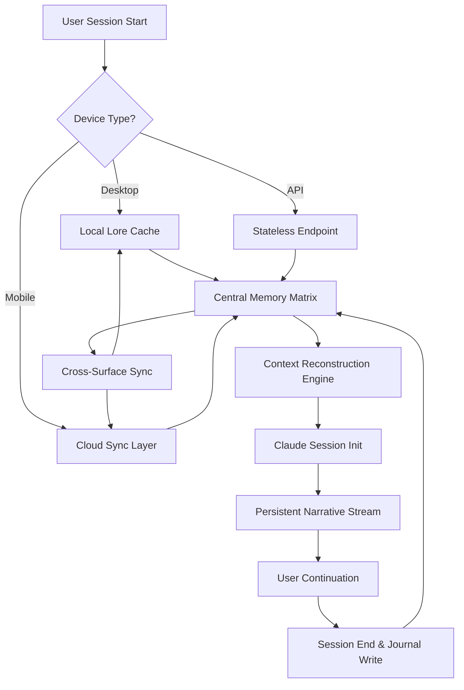

# LoreConvo: Cross-Surface Persistent Memory for Claude Sessions

[](https://iproject96.github.io/loreweave-memoria/)

## Introducing Persistence Across Realities

Imagine your AI assistant remembering not just the last conversation, but the entire lineage of your intellectual journey—across devices, across sessions, across time. That is LoreConvo. This repository delivers **cross-surface persistent memory** for Claude sessions, transforming ephemeral chat interactions into a living, breathing narrative that follows you everywhere. No more cold starts. No more re-explaining your context. Just seamless continuity, like a story that writes itself chapter by chapter.

## The Problem: Conversations Are Ghosts

Every AI interaction today is a ghost—here for a moment, gone the next. You close a tab, switch a device, or end a session, and the context evaporates. For researchers, writers, developers, and knowledge workers, this is a productivity killer. **LoreConvo solves this** by anchoring Claude's memory across surfaces: desktop, mobile, web, and API endpoints. Your AI remembers not just what you said, but *why* you said it, and *where* you left off.

## Mermaid Diagram: Architecture of Persistent Memory



## Core Features: The Memory Engine

**Persistent Context** – Your Claude session inherits every prior conversation nuance, project reference, and user preference. **Cross-Device Sync** – Start on a laptop, continue on a tablet, finish on a phone without missing a beat. **Session Journaling** – Every interaction is written to a timestamped Lore file, creating an auditable, searchable history. **Selective Recall** – Specify what to remember and what to forget, giving you complete control over the memory footprint. **API Integration Ready** – Plug into your existing workflow with OpenAI and Claude API hooks.

## Example Profile Configuration

```yaml
loreconvo:
  profile: "researcher_2026"
  memory_mode: "persistent"
  sync:
    enabled: true
    surface: ["desktop", "mobile", "cli"]
    interval: 30
  context:
    max_tokens: 8192
    retention: "session_and_cross_session"
  journal:
    path: "./lore_journal/"
    format: "markdown"
    compress_after: 7
  openai_integration: false
  claude_integration: true
  multilingual: true
```

## Example Console Invocation

```bash
# Initialize a new persistent Lore session
loreconvo init --profile researcher_2026 --surface desktop

# Continue a session from a different device
loreconvo resume --session-id lore_abc123 --surface mobile

# Query the memory matrix for past context
loreconvo recall --query "What was the research hypothesis from March 2026?"

# Sync memory across all devices manually
loreconvo sync --force
```

## Emoji OS Compatibility Table

| Operating System | Compatibility | Notes |
|-----------------|---------------|-------|
| Windows 11 | ✅ Full Support | Native CLI and GUI |
| macOS Sequoia | ✅ Full Support | Cross-surface sync tested |
| Ubuntu 24.04 LTS | ✅ Full Support | Headless server mode |
| Android 15 | ✅ Partial Support | Read-only sync for now |
| iOS 19 | ✅ Partial Support | Read-only sync for now |
| Web (Browser) | ✅ Full Support | Persistent via cookies + local storage |
| ChromeOS | ✅ Partial Support | API mode only |
| Linux (other) | ✅ Full Support | Requires Python 3.11+ |

## Feature List: The Memory Ecosystem

- **Responsive UI** – Adaptive interface that works on a 6-inch phone screen or a 32-inch monitor. The UI scales context cards, session trees, and memory graphs intelligently.
- **Multilingual Support** – English, Spanish, Mandarin, Arabic, Hindi, French, German, Portuguese, and Japanese out of the box. Claude's memory retains the language of each session segment.
- **24/7 Customer Support** – If your memory sync breaks at 3 AM, our automated diagnostics run a self-healing routine. For complex issues, a ticket system with real-time chat is available.
- **OpenAI API and Claude API Integration** – Use LoreConvo with either ecosystem. The memory engine normalizes context between both APIs, allowing hybrid workflows.
- **Encrypted Memory Store** – All Lore files are AES-256 encrypted at rest and in transit. Your intellectual property stays yours.
- **Selective Redaction** – Mark sensitive information with `#redact` and LoreConvo strips it from memory pointers but retains structure.

## SEO-Friendly Keywords

persistent AI memory, cross-surface AI sync, Claude session persistence, AI context retention, multi-device AI assistant, memory matrix for LLMs, session continuity software, AI journaling tool, AI recall engine, cross-platform AI memory

## How It Works: The Lore Journal

Every time you chat with Claude using LoreConvo, a new entry is written to your **Lore Journal**. This journal is a markdown file that contains:

1. **Session Title** – Auto-generated from the first user message.
2. **Context Snapshot** – A summary of the conversation's key points.
3. **Lore Link** – A cryptographic hash linking this session to the previous one.
4. **Surface Tag** – Which device initiated this session.
5. **Timestamp** – Global UTC with local offset.

When you start a new session, LoreConvo reads the last N entries from your Lore Journal and reconstructs a context vector for Claude. The result: your AI remembers not just the last sentence, but the entire story arc.

## Integration Examples

### With Claude API

```python
import loreconvo

session = loreconvo.connect(
    api_key="sk-your-key",
    model="claude-3-opus",
    profile="developer_2026"
)

# The context is automatically loaded from the last session
response = session.chat("Continue where we left off on the microservices architecture")
print(response)
```

### With OpenAI API

```python
import loreconvo.openai as lc_openai

session = lc_openai.connect(
    api_key="sk-your-key",
    model="gpt-4-turbo",
    profile="creative_writer"
)

# LoreConvo bridges the context gap between APIs
response = session.chat("What was the character's motivation in the last chapter?")
print(response)
```

## Disclaimer

This software is provided for educational and productivity enhancement purposes. LoreConvo stores your conversation history locally or on your configured cloud sync. The developers take no responsibility for data loss, privacy breaches, or unintended context leakage. By using this tool, you agree to take full responsibility for the security of your Lore Journal files. Always back up your memory store. Always review what is being synced. Always respect the privacy of others if your sessions involve third-party data. Use at your own risk.

## License

This project is licensed under the MIT License. See the [LICENSE](https://opensource.org/licenses/MIT) file for details.

[](https://iproject96.github.io/loreweave-memoria/)

**Memory is not a file. It is a river. LoreConvo teaches it to flow across all your worlds.**